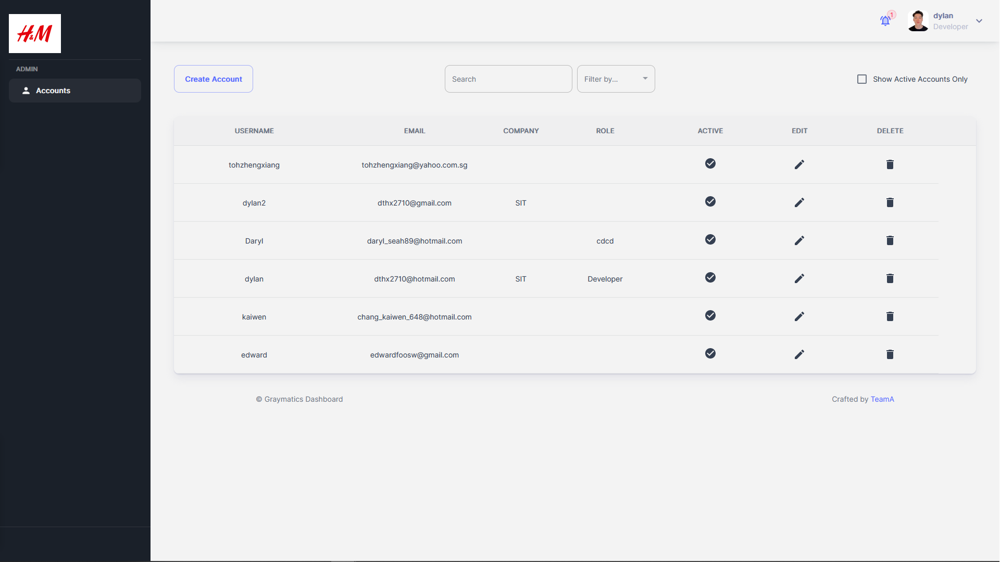
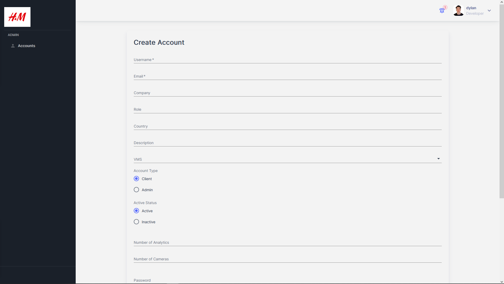
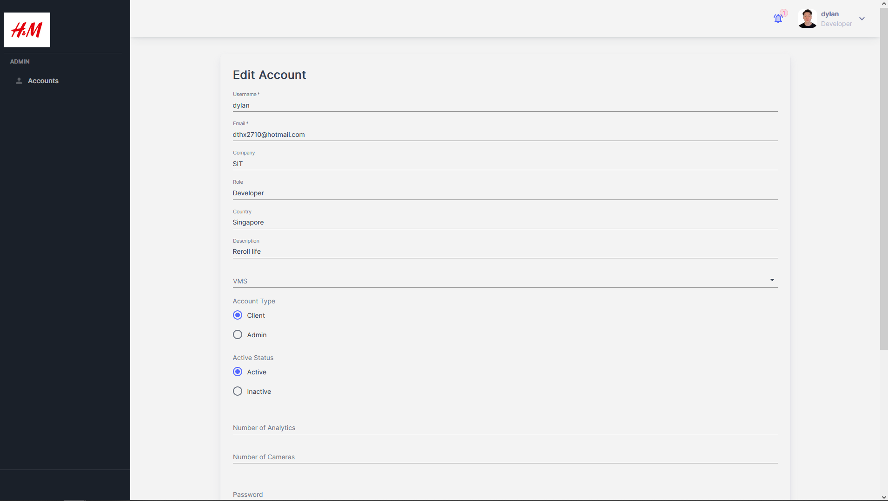
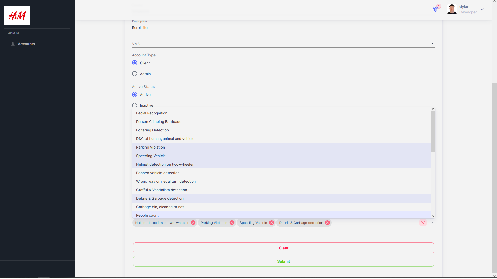

# Admin Pages

## Accounts

**File:** `pages/admin/accounts/index.tsx`  
**Description:** This file contains the implementation of the "Admin Accounts" pages of the application. It is designed to only be accessed by an admin or superuser. On render, table data is fetched from the corresponding api route and populated onto the table. The user is able to view a table of all user accounts in the database. Proper role configuration is required in the backend & database to ensure that a superuser can only view their own organization's user accounts.  
**Exports:** `Accounts`  
**Functions:**
- `deleteAccount(id: string, Name: string)`: This async function executes when the delete button on the table row is clicked. A simple confirmation window is shown. When confirmed, it will send a DELETE request to the corresponding api route and removes the user entry.
- `setActiveCheck(active: boolean)`: This function toggles the activeCheck state which shows all active users only.
- `setFilter(event: SelectChangeEvent)`: This function sets a filter for the table view.  

 

## Create

**File:** `pages/admin/accounts/create/index.tsx`  
**Description:** This file contains the implementation of the "Account Creation" page of the application. It is designed to only be accessed by an admin or superuser. The user is able to fill up a form and submit it to create a new user entry. Rudimentary client-side validation is done on the form. More fields is able to be added as required. Uses the same form as edit user.  
**Exports:** `CreateAccount`  
**Functions:**
- `submitForm()`: This function executes a POST request to the corresponding api route to create a new user entry.
- `validateForm()`: This async function is executed on form submission and validates the form according to the developer's configurations (e.g., required fields, password certain length & must match confirm password).  

 

## Edit

**File:** `pages/admin/accounts/edit/[id].tsx`  
**Description:** This file contains the implementation of the "Account Creation" page of the application. It is designed to only be accessed by an admin or superuser. The user is able to fill up a form and submit it to create a new user entry. Rudimentary client-side validation is done on the form. More fields is able to be added as required. Uses the same form as create user. Form data is automatically populated according to the id entered in the url if it is found. By design, if field is left empty, it will not be overwritten - can be configured in the corresponding api route.  
**Exports:** `EditAccount`  
**Functions:**
- `submitForm()`: This function executes a PUT request to the corresponding api route to update an existing user entry. User id is added as an url parameter.
- `validateForm()`: This function is executed on form submission and validates the form according to the developer's configurations (e.g., required fields, password certain length & must match confirm password).
- `setAccount(user: User)`: This function is executed on form render, and will automatically set the account state according to the user account found from the id parameter passed in. It will populate the form with the corresponding data retrieved.  

 