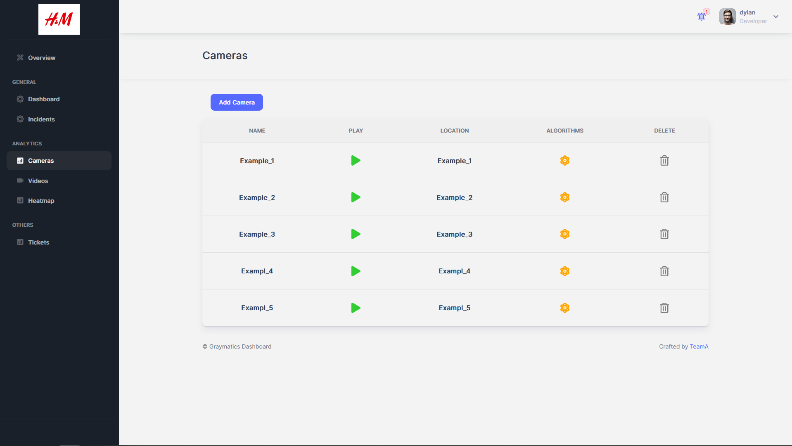

# Cameras Pages

## Cameras

**File**: `pages/analytics/cameraslist/index.tsx`  
**Description**:  
This file contains the implementation of the "Cameras" page of the application. This page allows the user to view a list of cameras, add new cameras to the list, and edit the camera details. The page is implemented using the Next.js framework and the Material-UI component library.  
**Exports**:
- `Cameraslist`: A functional component that implements the "Cameras" page.  
**Functions**:
- `getCameras()`: A function that fetches the list of cameras from the API and sets the state variable 'cameras' to the retrieved data.
- `handleSubmit()`: A function that handles the form submission for adding a new camera to the list. It constructs a new camera object using the form data and sends a POST request to the API to add the camera. If the request is successful, the modal window is closed and the 'loadTable' state variable is set to true to trigger a reload of the camera list.  

  

## Algorithms

**File**: `pages/analytics/cameraslist/algorithms.tsx`  
**Description**:  
This file contains the implementation of the "Algorithms" page of the application. The page displays a video feed from a camera and settings for various algorithms. The user can toggle the visibility of the algorithm settings using chevron buttons. The page is implemented using the React framework and the Material-UI and Ant Design component libraries.  
**Exports**:
- `Algorithms`: A functional component that implements the "Algorithms" page.  

  