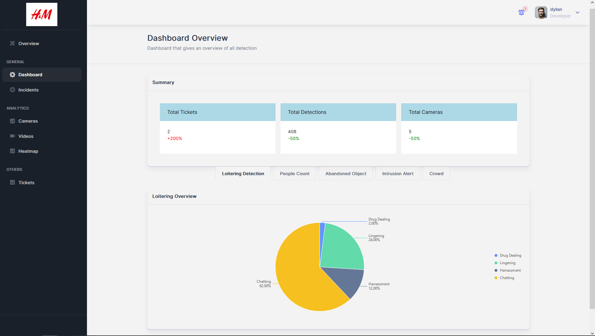

# General Pages

## Dashboard

**File:** `pages/general/dashboard.tsx`  
**Description:** This file contains the implementation of a dashboard view. The dashboard shows various analytics charts for video surveillance data, such as total detections, number of cameras, and specific detection types like abandoned objects, people counting, crowd counting, loitering, and intrusion.  
**Exports:** `Dashboard`  
**Functions:**
- `getTotalDetections()`: This function makes an API call to the backend to fetch the total number of detections and updates the state variable `totalDetection` with the retrieved value.
- `getTotalTickets()`: This function makes an API call to the backend to fetch the total number of tickets and updates the state variable `totalTicket` with the retrieved value.
- `getTotalCameras()`: This function makes an API call to the backend to fetch the total number of cameras and updates the state variable `totalCamera` with the retrieved value.
- `getLoiteringData()`: This function makes an API call to the backend to fetch data related to loitering events and updates the state variable `loiteringData` with the retrieved value.
- `getPeopleData()`: This function makes an API call to the backend to fetch data related to people detection events and updates the state variable `peopleData` with the retrieved value.
- `getAbandonedData()`: This function makes an API call to the backend to fetch data related to abandoned object detection events and updates the state variable `abandonedData` with the retrieved value.
- `getIntrusionData()`: This function makes an API call to the backend to fetch data related to intrusion detection events and updates the state variable `intrusionData` with the retrieved value.
- `getCrowdData()`: This function makes an API call to the backend to fetch data related to crowd detection events and updates the state variable `crowdData` with the retrieved value.  

  