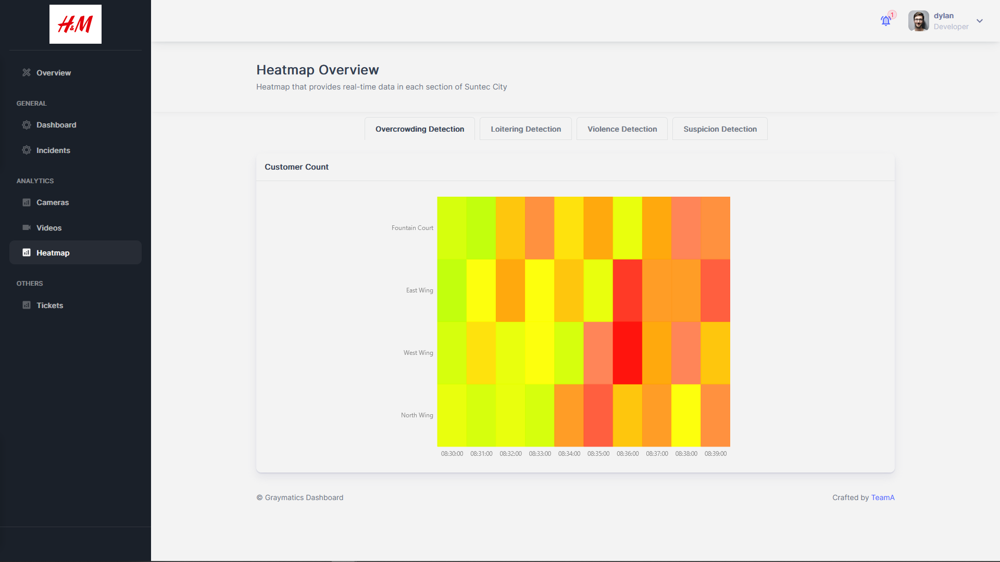

# Heatmap Page

  

## Heatmap

**File:** `pages/analytics/heatmap.tsx`  
**Description:** This file contains the implementation of the "Heatmap" page of the application. The page displays three heatmaps, each under one tab. The heatmaps are for overcrowding detection, loitering detection, violence detection, and suspicion detection (detection of suspicious people/items).  
**Exports:**
- `Heatmap`: A functional component that implements the "Heatmap" page.  

## Loitering Component

**File:** `pages/gray-app/src/components/Chart/Heatmaps/Loitering.tsx`  
**Description:** This file contains the function and configuration that will retrieve the Loitering Detection data and create the heatmap using the data.  
**Exports:**
- `LoiteringHeatmap`: A functional component that implements the Loitering Detection heatmap to be used in the 'Heatmap' page.  

## Overcrowding Component

**File:** `pages/gray-app/src/components/Chart/Heatmaps/Overcrowding.tsx`  
**Description:** This file contains the function and configuration that will retrieve the Overcrowding Detection data and create the heatmap using the data.  
**Exports:**
- `OvercrowdingHeatmap`: A functional component that implements the Overcrowding Detection heatmap to be used in the 'Heatmap' page.  

## Suspicion Component

**File:** `pages/gray-app/src/components/Chart/Heatmaps/Suspicion.tsx`  
**Description:** This file contains the function and configuration that will retrieve the Suspicion Detection data and create the heatmap using the data.  
**Exports:**
- `SuspicionHeatmap`: A functional component that implements the Suspicion Detection heatmap to be used in the 'Heatmap' page.  

## Violence Component

**File:** `pages/gray-app/src/components/Chart/Heatmaps/Violence.tsx`  
**Description:** This file contains the function and configuration that will retrieve the Violence Detection data and create the heatmap using the data.  
**Exports:**
- `ViolenceHeatmap`: A functional component that implements the Violence Detection heatmap to be used in the 'Heatmap' page.
