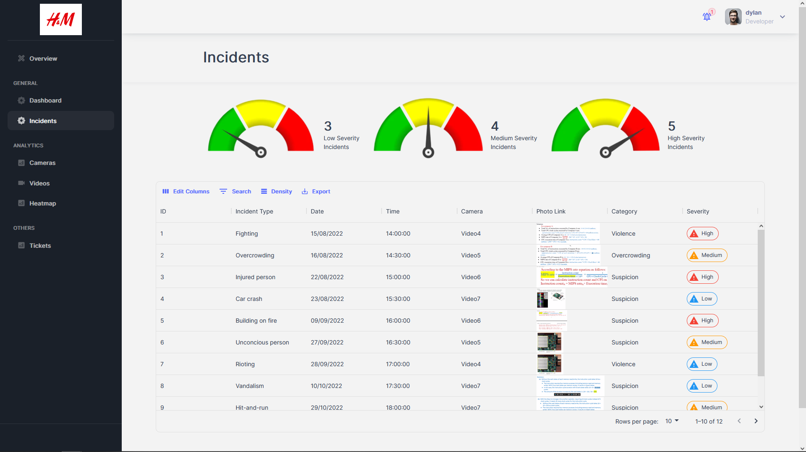

# Incidents Pages

  

## Incidents

**File**: `pages/general/incidents/index.tsx`  
**Description**: This file contains the implementation of the "Incidents" page of the application. This page allows the user to view a list of incidents. The page is implemented using the Next.js framework and the Material-UI component library.  
**Exports**:  
- `Incidents`: A functional component that implements the "Incidents" page.  

## Incidents Table Component

**File**: `gray-app/src/incidents/IncidentsTable.tsx`  
**Description**: This file contains the functions and components that will create and populate the table with incident data and create their individual rows.  
**Exports**:  
- `IncidentsTable`: A functional component that implements the 'Incidents' page  
**Functions**:  
- `getSeverityLabelProps()`: This function handles the rendering of icons for High, Medium and Low severities in the table
- `getIncidentData()`: This function will send a GET request to the backend via API call to retrieve the incident data in JSON format  
