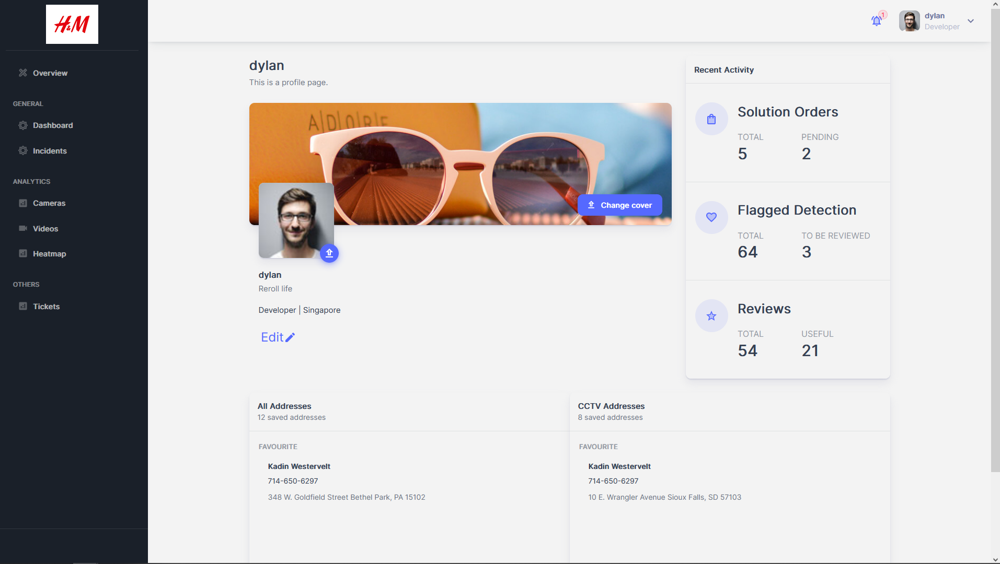

# Management Pages

## Profile

**File**: `pages/management/profile.tsx`  
**Description:** This file contains the implementation of the "Profile" page of the application. This page allows the user to view and edit their profile details, such as their profile picture, job title, and address. The page is implemented using the Next.js framework and the Material-UI component library.  
**Exports:**: Profile: A functional component that implements the "Profile" page.  
**Functions:**
- `useSession()`: A hook from the next-auth/react library that retrieves the current user session. It returns an object containing the session data and the status of the session.  

  

## Settings

**File**: `pages/management/settings/index.tsx`  
**Description:** This file contains the implementation of the "Settings" page of the management section of the application. This page allows the user to view and edit their account settings, including general settings, profile information, and notifications. The page is implemented using the Next.js framework and the Material-UI component library.  
**Exports:** `ManagementUserSettings`: A functional component that implements the "Settings" page.  
**Functions:**
- `handleTabsChange(event: ChangeEvent<{}>, value: string)`: A function that handles the change of tabs on the page, updating the 'currentTab' state variable with the selected tab's value.  

  

