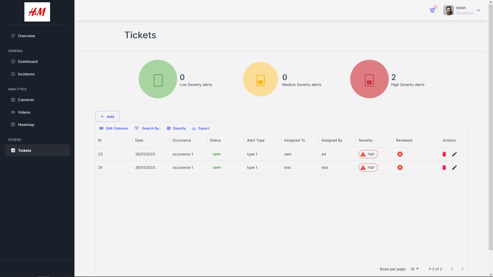

# Tickets Page

  

## Tickets

**File**: `pages/others/tickets.tsx`  
**Description**: This file is the index file which is the entry point for the 'Tickets' page of the application. This page allows the user to view, upload, edit and delete tickets.The page is implemented using the Next.js framework and the Material-UI component library.  
**Exports**: 
- `reloadTableContext`: This context will wrap the whole of the videos page with the use of the React Provider. This will enable all components within the app to do a GET request whenever there is any changes to the list.  
- `tickets`: A functional component that implements the 'Tickets' page  

## Tickets Table Component

**File**: `gray-app/src/Tickets/TicketsTable.tsx`  
**Description**: This file contains the functions and components that will create and populate the table with data and create their individual rows.  
**Exports**: 
- `TicketsTable`: A functional component that implements the 'Tickets' page  
**Functions**:
- `getSeverityProps()`: This function handles the rendering of icons for severities in the table
- `getStatusParams()`: This function handles the rendering of icons for statuses in the table
- `columns()`: This handles the creation and population of the table
- `getTicketData()`: This function will make a GET request to the backend via API call to retrieve the data  

## Tickets Form Component

**File**: `gray-app/src/Tickets/NewTicketForm.tsx`  
**Description**: This file is a component which will produce the upload dialog where users will be enter the ticket details and upload them onto the database.  
**Exports**: 
- `NewTicketForm`: A functional component that implements the upload dialog  
**Functions**:
- `handleCreate()`: This function will send a POST API call to upload the ticket details onto the database
- `handleChange()`: This function handles any changes made in the textfields from the user input.
- `handleClickOpen()`: This function handles the onclick function for the dialog.
- `handleClose()`: This function handles the closing of the dialog.
- `validateForm()`: This function will validate the fields where users are required to enter.  

## Tickets Edit Form Component

**File**: `gray-app/src/Tickets/EditForm.tsx`  
**Description**: This file is a component which will produce the Edit dialog where users will be able to edit the ticket details and upload them onto the database.  
**Exports**: 
- `NewTicketForm`: A functional component that implements the Edit dialog  
**Functions**:
- `handleEdit()`: This function will send a PUT API call to upload the ticket details onto the database
- `handleChange()`: This function handles any changes made in the textfields from the user input.
- `handleClickOpen()`: This function handles the onclick function for the dialog.
- `handleClose()`: This function handles the closing of the dialog.
- `validateForm()`: This function will validate the fields where users are required to enter.  

## Delete Ticket Component

**File**: `gray-app/src/Tickets/DeleteTicket.tsx`  
**Description**: This file is a component which will produce the Delete confirmation where users will be able to delete the ticket from the database/
**Exports**: 
- `DeleteTicket`: A functional component that implements the Delete dialog  
**Functions**:
- `handleDelete()`: This function will send a DELETE API call to upload the ticket details onto the database.
- `handleClose()`: This function handles the closing of the dialog.
