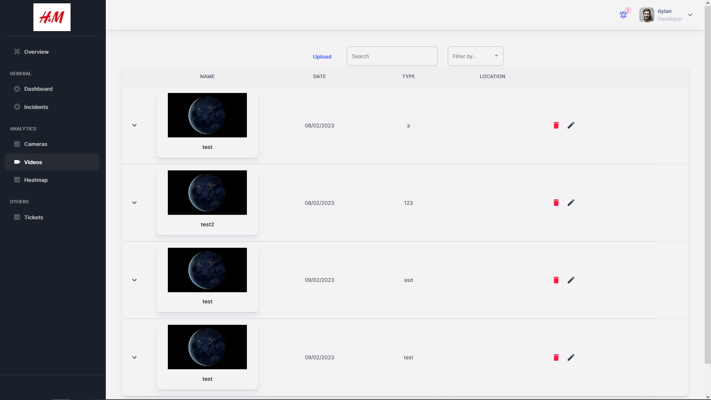

# Videos Page

  

## Videos

**File:** `pages/analytics/videos/index.tsx`  
**Description:** This file is the index file which is the entry point for the 'Videos' page of the application. This page allows the user to view, upload, edit and delete videos. The page is implemented using the Next.js framework and the Material-UI component library.  
**Exports:**
- `reloadVideoContext`: This context will wrap the whole of the videos page with the use of the React Provider. This will enable all components within the app to do a GET request whenever there is any changes to the list.
- `MyVideos`: A functional component that implements the 'videos' page  
**Functions:**
- `inputHandler()`: This function takes in an input from the text field and sets it into the inputText state.  

## Videos Filter Component

**File:** `gray-app/src/videos/FilterMenu.tsx`  
**Description:**  
This file is a component which takes in props from the 'index.tsx' file and contains the dropdown menu for users to select how they want to filter the table by.  
**Exports:**
- `FilterMenu`: A functional component that implements the filter dropdown box  
**Functions:**
- `handleChange()`: handles the changes made in the form  

## Video Upload Component

**File:** `gray-app/src/videos/VideoUploadWindow.tsx`  
**Description:** This file is a component which will produce the video upload dialog where users will be enter the video details and upload them onto the database.  
**Exports:**
- `VideoUploadWindow`: A functional component that implements the upload dialog  
**Functions:**
- `handleFile()`: This function generates the 'video_uuid' field with the uuidV4() import, sets the name of the file and finally set the file into the 'file' state
- `handleFileUpload()`: This function will send a POST API call to upload the video file onto the database
- `handleVideoUpload()`: This function will send a POST API call to upload the video details onto the database
- `handleChange()`: This function handles any changes made in the textfields from the user input.
- `handleClickOpen()`: This function handles the onclick function for the dialog.
- `handleClose()`: This function handles the closing of the dialog.
- `validateForm()`: This function will validate the fields where users are required to enter.  

## Videos Table Component

**File:** `gray-app/src/videos/VideoList.tsx`  
**Description:**  
This file contains the skeleton of the table, name and size of the column.The page is implemented using the Next.js framework and the Material-UI component library.  
**Exports:**
- `VideoList`: A functional component that implements the videosList  

## Videos Row Component

**File:** `gray-app/src/videos/VideoRows.tsx`  
**Description:** This file contains the functions and components that will populate the table with data and create their individual rows.  
**Exports:**
- `VideoRows`: A functional component that implements the setting of data in the table rows  
**Functions:**
- `getVideoData()`: This function will make a GET request to the backend via API call to retrive the data from the database. The data will then be stored in the videoData state.
- `filteredData()`: This function will retrieve the user input from the 'index' file and display the data on the table based on the filter.
- `handleDescriptionButton()`: This function handles the description button for each data entry  

## Delete Video Component

**File:** `gray-app/src/videos/VideoDelete.tsx`  
**Description:** This file contains the component which will display the Delete video confirmation dialog  
**Exports:**
- `VideoDelete`: A functional component that deletes the video and data  
**Functions:**
- `handleVideoDelete()`: This function will make a API call to the the supabase storage to delete the video file from the database storage.
- `handleDelete()`:This function will make a DELETE request to the backend to delete the video data
- `handleClose()`:This function the closing of the dialog  

## Edit Video Component

**File:** `gray-app/src/videos/VideoInfoEdit.tsx`  
**Description:** This file contains the component which will display the edit video Dialog
**Exports:**
- `VideoInfoEdit`: A functional component that edits the video data  
**Functions:**
- `handleChange()`:This function handles any changes made in the textfields from the user input.  
- `handleClickOpen()`:This function handles the onclick open for the dialog
- `handleClose()`:This function handles the closing of the dialog
- `handleEdit()`:This function will make a PUT request to the backend to edit the video data  

## Video MediaCard Component

**File:** `gray-app/src/videos/VideoMediaCard.tsx`  
**Description:** This file contains the component which will display the video and the thumbnail  
**Exports:**
- `VideoInfoEdit`: A functional component that displays the video thumbnail and video when clicked  
